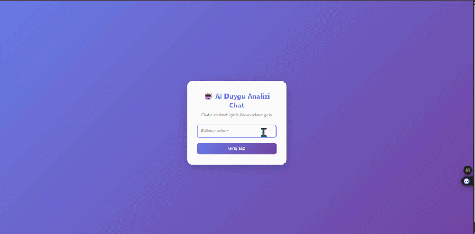

# AI-Duygu-Analizi-Chat-App

AI ile duygu analizi yapan çok kullanıcılı chat uygulaması.

## 🚀 Özellikler

- **Çok Kullanıcılı Chat**: Birden fazla kullanıcı aynı anda chat yapabilir
- **AI Duygu Analizi**: Her mesaj için AI'dan duygu analizi cevabı alınır
- **Gerçek Zamanlı Güncelleme**: Mesajlar otomatik olarak güncellenir
- **Kullanıcı Yönetimi**: Aktif kullanıcıları görüntüleme
- **Mesaj Geçmişi**: Tüm mesajlar veritabanında saklanır

## 📁 Proje Yapısı

```
AI-Duygu-Analizi-Chat-App/
├── backend/          # ASP.NET Core Web API
├── frontend/         # React + Vite
├── ai-service/       # Python AI servisi (Hugging Face)
└── mobile/          # Mobile uygulama (gelecekte)
```


## 🎯 Kullanım

1. Backend'i başlatın (`dotnet run` - backend klasöründe)
2. Frontend'i başlatın (`npm run dev` - frontend klasöründe)
3. Tarayıcıda `http://localhost:3000` adresine gidin
4. Bir kullanıcı adı girin ve chat'e katılın
5. Mesaj gönderin ve AI'dan duygu analizi cevabı alın!

## 🔧 Teknolojiler

- **Backend**: ASP.NET Core 9.0, SQLite
- **Frontend**: React 18, Vite
- **AI Service**: Python, Gradio Client, Hugging Face
- **Veritabanı**: SQLite

## 📝 API Endpoints

- `POST /api/chat` - Yeni mesaj gönder
- `GET /api/chat/history?username={username}` - Mesaj geçmişini getir
- `GET /api/users` - Aktif kullanıcıları listele

## 🎨 Özellikler

- Modern ve responsive UI
- Gerçek zamanlı mesaj güncelleme
- Kullanıcı bazlı mesaj filtreleme
- AI entegrasyonu ile duygu analizi

## 🎬 Demo



